## HỆ THỐNG MICROSERVICES – EProject

Dự án này xây dựng một hệ thống phần mềm ứng dụng trong lĩnh vực thương mại điện tử có khả năng mở rộng theo hướng **kiến trúc Microservices**, sử dụng **Node.js**, **Express**, **JWT**, **Mongoose**, **MongoDB**, **AMQP**, và được đóng gói bằng **Docker**.

Mục tiêu của hệ thống là quản lý người dùng, sản phẩm và đơn hàng một cách tách biệt, đồng thời đảm bảo khả năng mở rộng linh hoạt.

---

## Kiến trúc tổng quan

Hệ thống được chia thành nhiều dịch vụ (service) nhỏ và độc lập. Mỗi service chịu trách nhiệm cho một phần nghiệp vụ riêng, khi giao tiếp với nhau mang lại nhiều lợi ích, cho phép có những tính năng mở rộng hệ thống, hoặc cô lập lỗi trên các module khác nhau, giúp việc phát triển và triển khai trở nên dễ dàng hơn. 


### Các thành phần chính:

* **API Gateway**:
  Đóng vai trò rất quan trọng. 
  Là cổng giao tiếp duy nhất giữa client và hệ thống. 
  Nó tiếp nhận tất cả các yêu cầu và định tuyến chúng đến các service tương ứng.

* **Authentication Service**:
  Đây là dịch vụ xử lý chức năng đăng ký, đăng nhập và xác thực người dùng bằng JWT (JSON Web Token).
  Dịch vụ này đảm bảo rằng chỉ những người được phân quyền mới có thể truy cập vào các tài nguyên trong ứng dụng.
  Đây là một dịch vụ quan trọng, đóng vai trò bảo mật cho toàn bộ hệ thống.

* **Product Service**:
  Đây là dịch vụ về nghiệp vụ sản phẩm, chịu trách nhiệm quản lý thông tin liên quan đến sản phẩm như chi tiết sản phẩm, hàng tồn kho, giá cả.
  Dịch vụ này cung cấp các API để thực hiện CRUD (CREATE, READ, UPDATE, DELETE) trên sản phẩm.

* **Order Service**:
  Đây là dịch vụ nói về quá trình tạo ra đơn hàng và xử lý, quản lý đơn hàng.
  Hỗ trợ trong các quy trình đặt hàng, theo dõi đơn hàng, tính toán tổng giá trị trên đơn hàng.
  Dịch vụ này sẽ giao tiếp với Product Service.

---

## Cơ chế giao tiếp giữa các service

Các service nghiệp vụ giao tiếp với nhau bằng cơ chế truyền thông điệp với 2 nguyên tắc:

* **Giao tiếp đồng bộ (Synchronous)**:
  Các request từ client sẽ được gửi tới **API Gateway**, sau đó Gateway chuyển tiếp đến các service thông qua **HTTP RESTful API**.

* **Giao tiếp bất đồng bộ (Asynchronous)**: 
  Các service trao đổi thông tin qua cơ chế **Push-based**, phương pháp **Advaned Message Queue Protocol** dùng công cụ **RabbitMQ**

### Authentication Flow
- Client → API Gateway → Auth Service → MongoDB
### Product Management Flow
- Client → API Gateway → Product Service → MongoDB
- Product Service → RabbitMQ → Order Service
### Order Processing Flow
- Client → API Gateway → Order Service → MongoDB
- Order Service → RabbitMQ → Product Service

---

## Cơ sở dữ liệu

Dự án tuân thủ nguyên tắc **“Database per Service”** — tức là **mỗi service có một cơ sở dữ liệu MongoDB riêng biệt**, giúp đảm bảo tính độc lập, dễ bảo trì và giảm thiểu rủi ro khi mở rộng.

---

## Công nghệ sử dụng

| Thành phần            | Công nghệ                |
| --------------------  | ----------------------   |
| **Backend**           | Node.js, Express         |
| **Database**          | MongoDB (Mongoose ODM)   |
| **Message Broker**    | AMQP (RabbitMQ)          |
| **Authentication**    | JWT (JSON Web Tokens)    |
| **Containerization**  | Docker, Docker Compose   |
| **API Communication** | REST API, Message Queues |
| **Development**       | Nodemon, Dotenv          |
| **Testing**           | Mocha, Chai, Chai-HTTP   |

---

## Cấu trúc thư mục

```
EPROJECT/
├──  api-gateway/              # API Gateway Service
├──  auth/                     # Authentication Service
├──  product/                  # Product Management Service
├──  order/                    # Order Processing Service
├──  utils/                    # Shared Utilities
├──  docker-compose.yml        # Docker Orchestration
└──  README.md                 # Project Documentation
```

---

## API Endpoints

### Auth Service

| Method | Endpoint     | Chức năng              | Authentication  |
|--------|--------------|------------------------|-----------------|
| `POST` | `/register`  | Đăng ký người dùng mới | ❌             |
| `POST` | `/login`     | Đăng nhập hệ thống     | ❌             |
| `GET`  | `/dashboard` | Truy cập vào trang chủ | ✅             |

### Product Service

| Method | Endpoint            | Chức năng                          | Authentication |
|--------|---------------------|------------------------------------|----------------|
| `GET`  | `/api/products`     | Lấy danh sách sản phẩm             | ✅            |
| `POST` | `/api/products`     | Tạo sản phẩm mới                   | ✅            |
| `POST` | `/api/products/buy` | Tạo đơn hàng mới                   | ✅            |
| `GET`  | `/api/products/:id` | Hiển thị thông tin sản phẩm với id | ✅            |

---

## Hướng dẫn cài đặt và khởi chạy

### Yêu cầu môi trường

Trước khi bắt đầu, hãy đảm bảo bạn đã cài đặt:

* [Docker Desktop](https://www.docker.com/products/docker-desktop/)
* [Docker Compose](https://docs.docker.com/compose/)
* [Git](https://git-scm.com/)

---

### Các bước thực hiện

#### 1️. Clone dự án về máy:

```bash
git clone https://github.com/baoloc30/22635241-DoPhanBaoLoc-EProject.git
cd 22635241-DoPhanBaoLoc-EProject
```

#### 2️. Tạo các file `.env` cần thiết

Hệ thống sử dụng nhiều file `.env` để lưu biến môi trường.

#### 3️. Xây dựng và chạy hệ thống với Docker Compose

```bash
docker-compose build
docker-compose up
```

---

#### 4️. Kiểm tra container đang chạy

```bash
docker ps
```

Nếu thành công, bạn sẽ thấy khoảng **8 container** hoạt động (3 service + 3 DB + RabbitMQ + Gateway).

---

## Ảnh demo
### Đăng ký
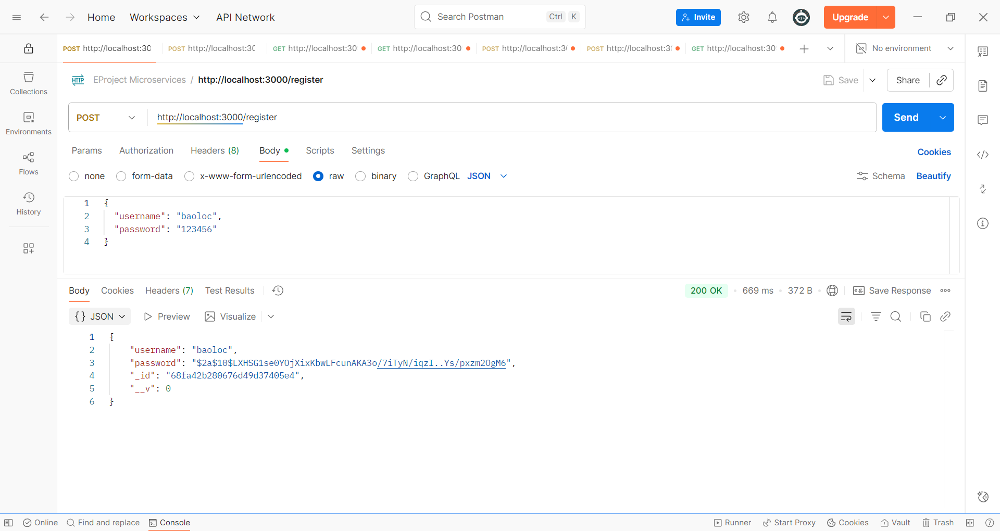

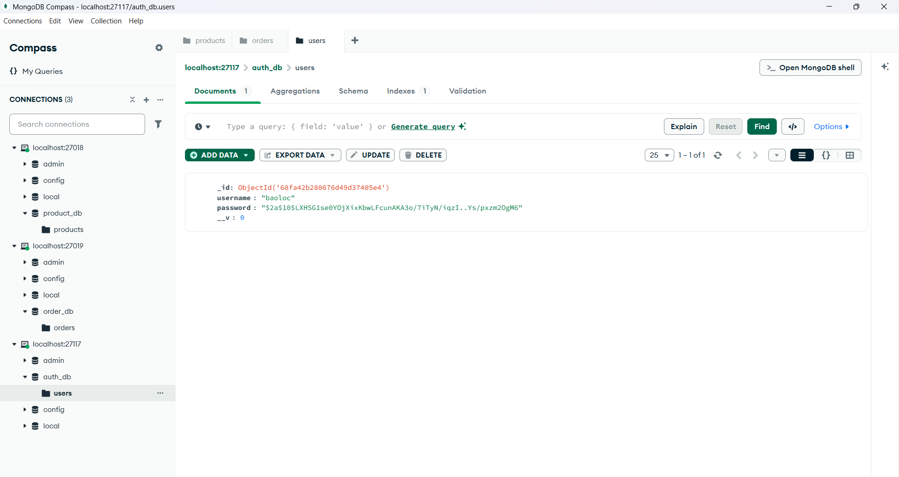

### Đăng nhập
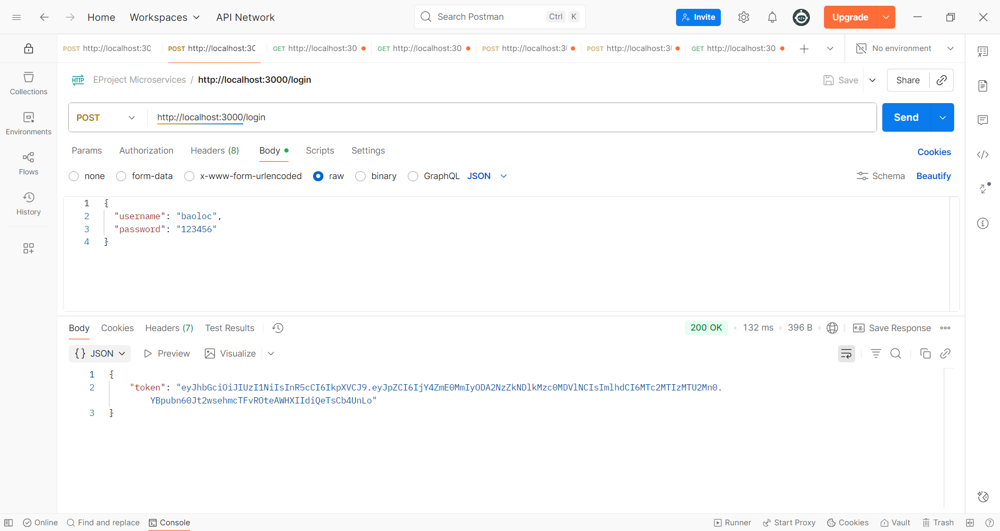

### Dashboard with token
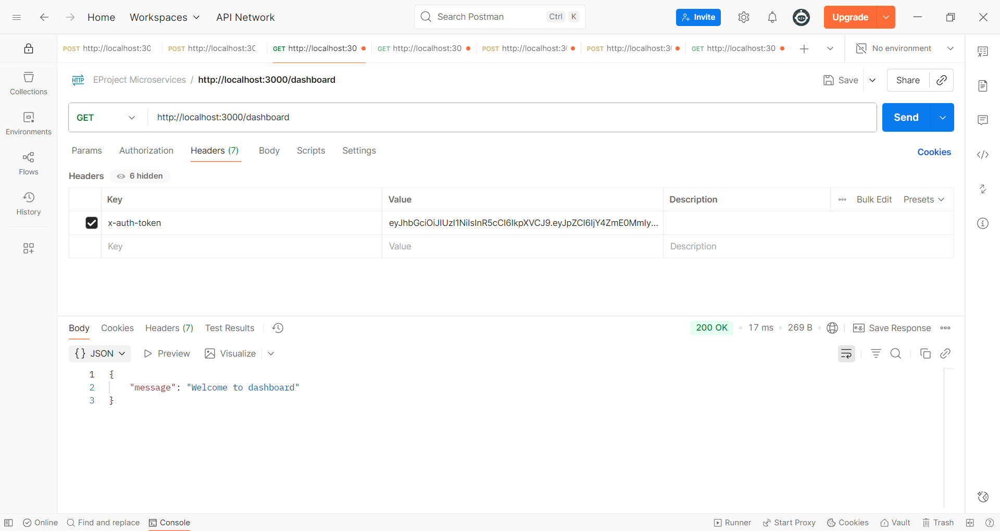

### Kiểm tra docker
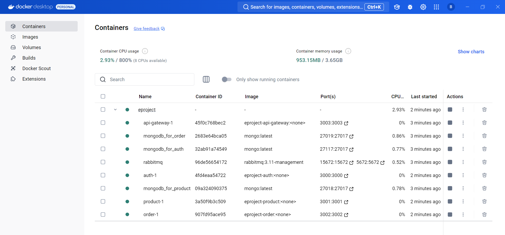

### Thêm sản phẩm
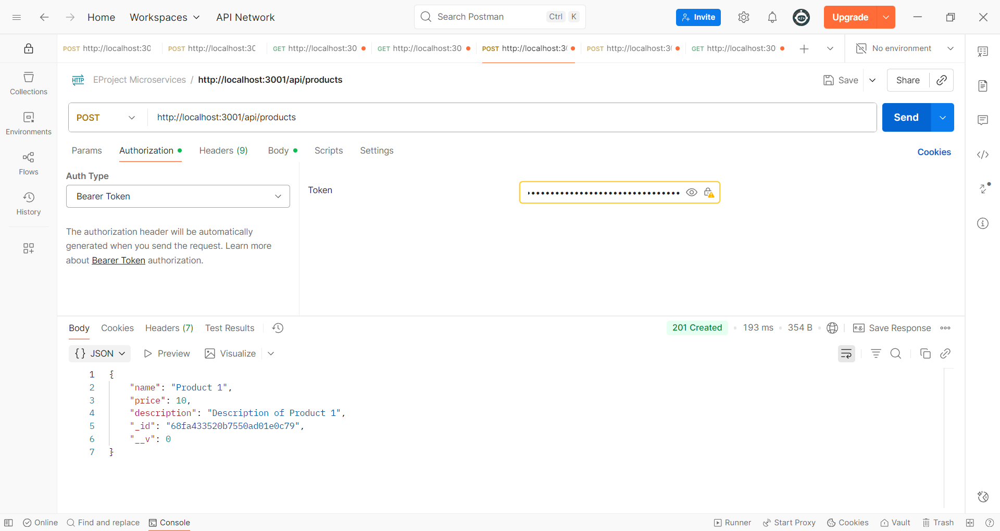

### Danh sách sản phẩm
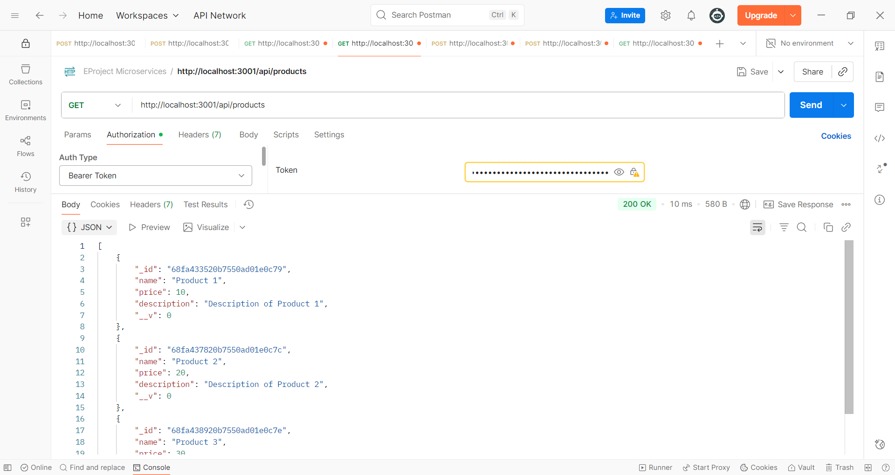

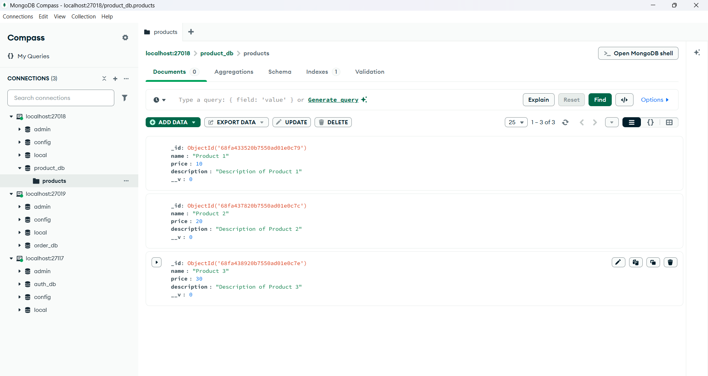

### Thêm đơn hàng
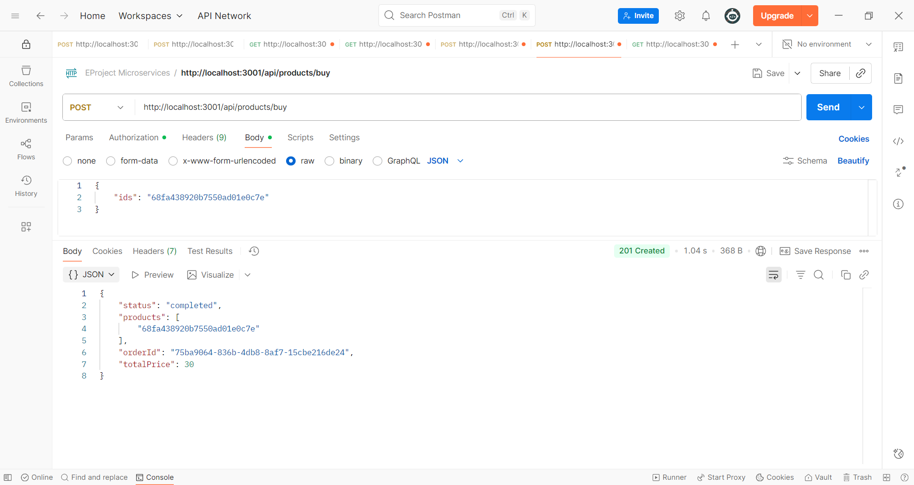

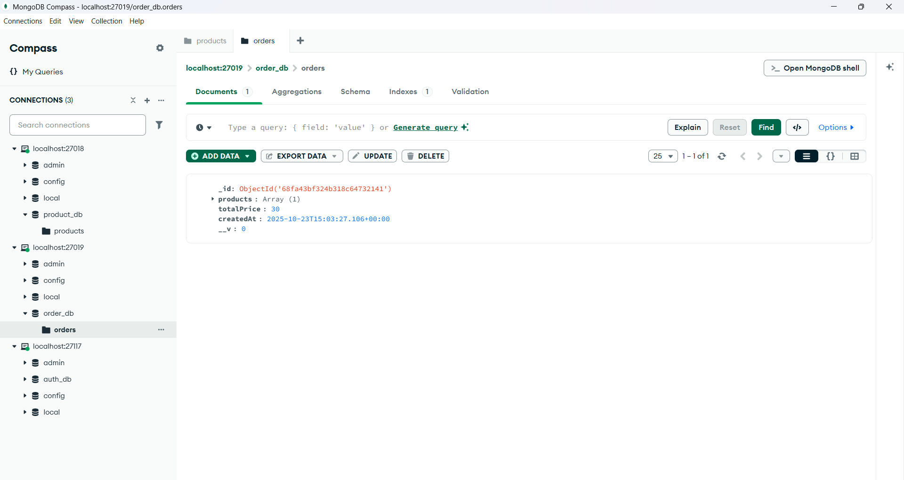

### Hiển thị thông tin sản phẩm với id
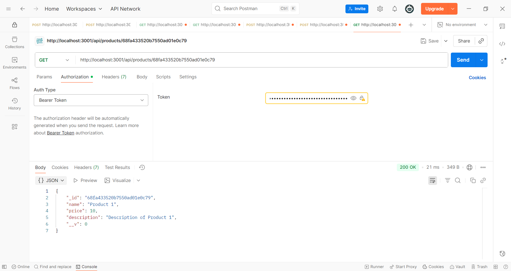

### Rabbit Message Queue
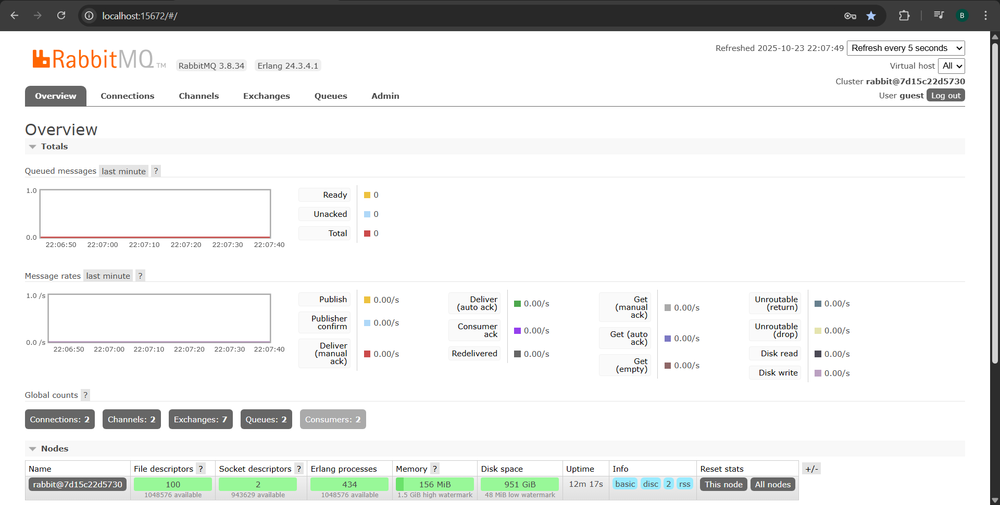

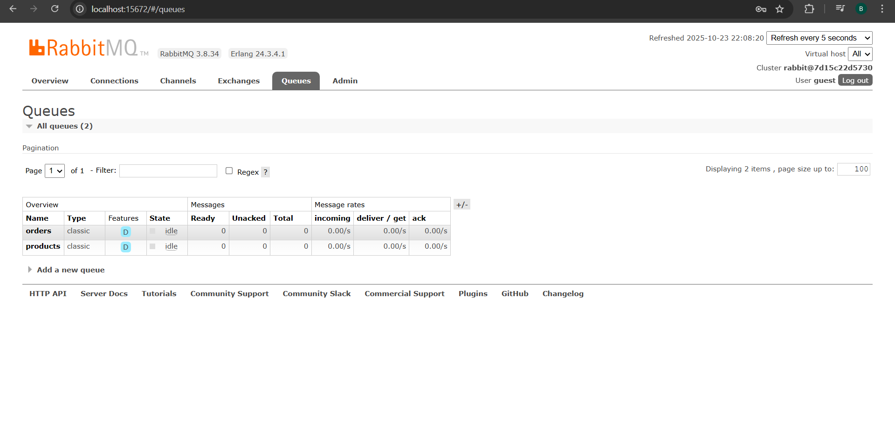

---

## Ghi chú

* Dự án được thiết kế theo hướng mô-đun, dễ mở rộng thêm service mới.
* Có thể triển khai trên cloud (AWS, GCP, hoặc Azure) với cấu trúc microservices tương tự.
* Sử dụng JWT giúp xác thực an toàn, còn RabbitMQ giúp các service giao tiếp linh hoạt, giảm độ phụ thuộc.

---

* Sinh viên thực hiện: Đỗ Phan Bảo Lộc
* MSSV: 22635241
* Lớp: DHHTTT18A
